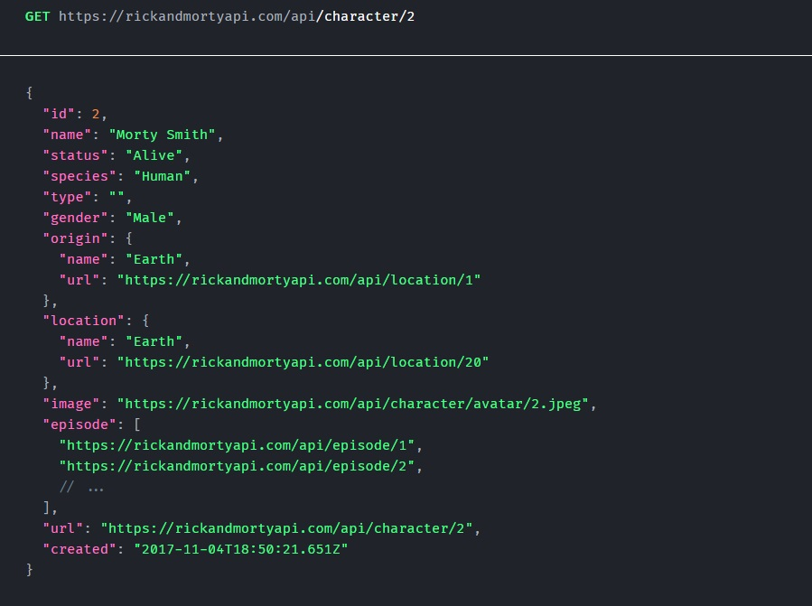
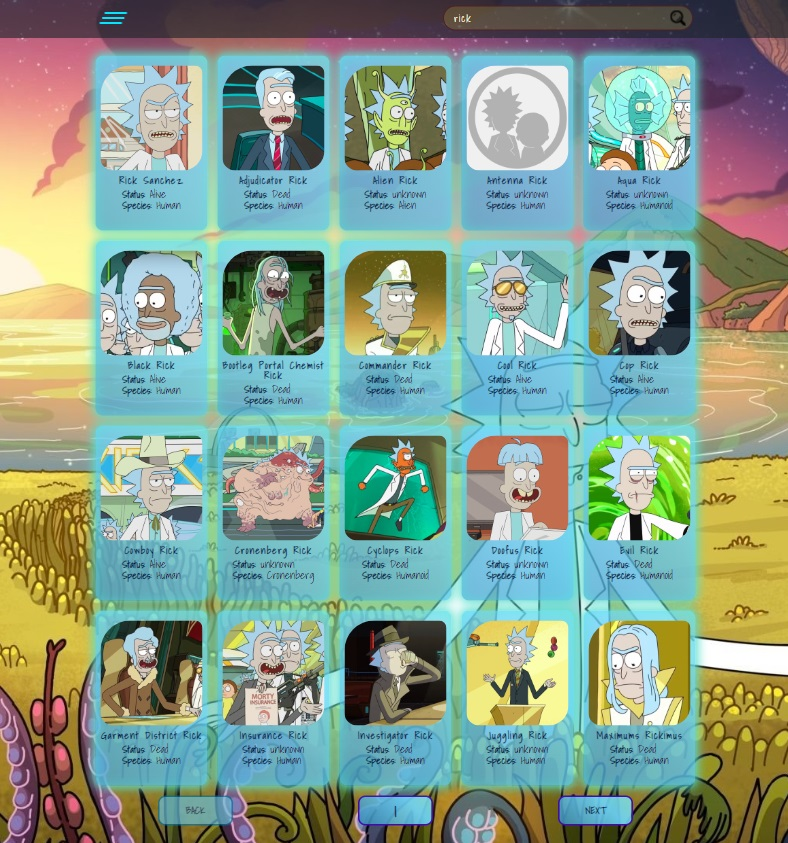

# Website project - The Rick and Morty
A site to search for characters from "The Rick and Morty" universe.
___
## The project used:
* React:
  * useState;
  * useEffect;
  * useContext;
  * useNavigate;
  * useParams;
  * useForm;
  * React Router;
* API

## Completed in the project:
* authorization;
* validation;
* all characters with a brief description;
* pagination;
* search by personage;
* sorting;
* single character page with full description;
* dark/light theme;

#### API
__API used : https://rickandmortyapi.com/api__
It is currently three available resources:
* Character: used to get all the characters.
* Location: used to get all the locations.
* Episode: used to get all the episodes.

We will use the API: __[Character](https://rickandmortyapi.com/api/character)__.

There is a total of 826 characters sorted by id.
__Example request by id:__

#### Project preview:

___

